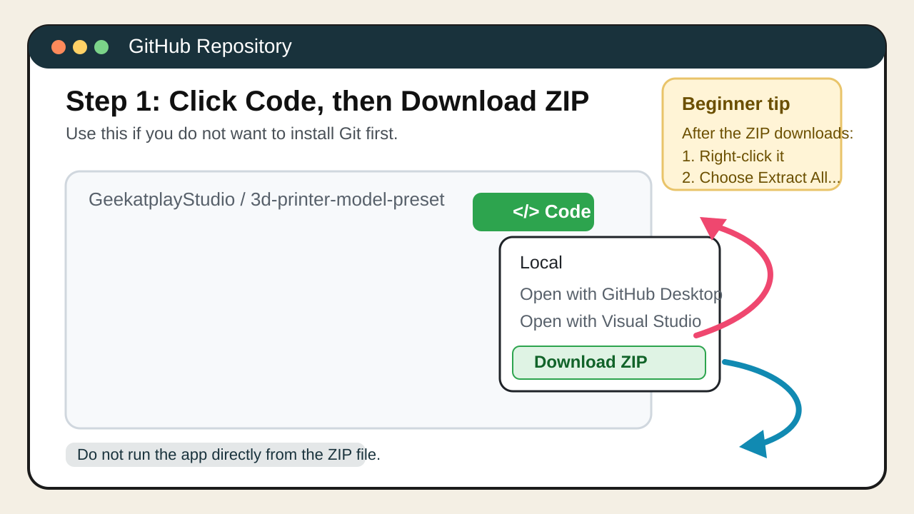
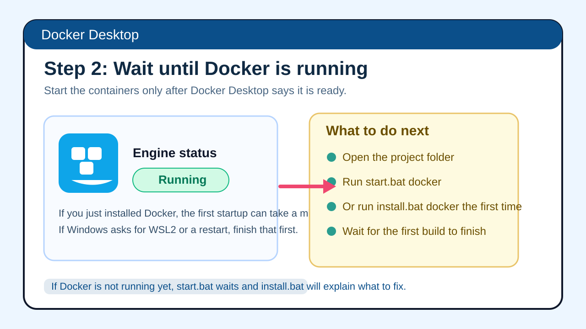
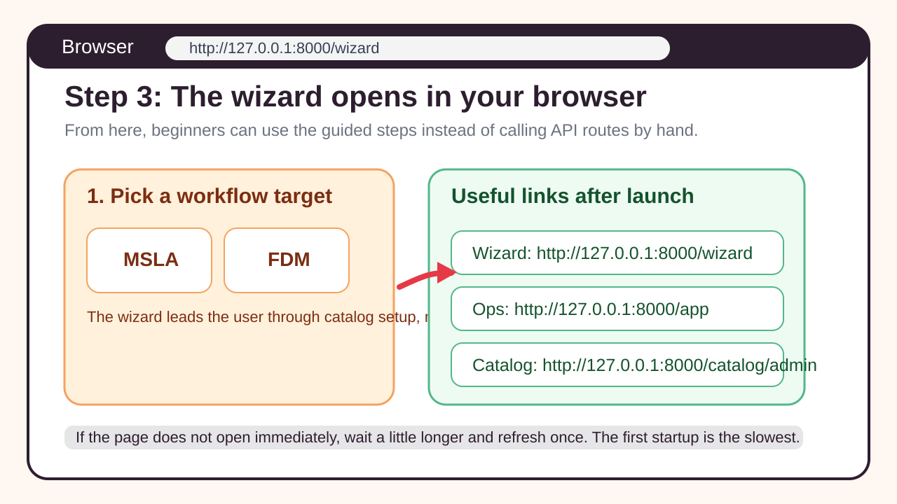

# Geekatplay Studio 3D Print Ops

Geekatplay Studio 3D Print Ops is a local-first FastAPI backend and browser toolkit for analyzing printable geometry, maintaining a source-attributed printer and material catalog, and generating slicer-ready exports for MSLA/resin and first-pass FDM/filament workflows.

Legacy compatibility note: internal package names, environment variables, SQLite file names, and some route parameters still use `resinlogic` or `resin` identifiers. The external product/documentation surface is branded as Geekatplay Studio.

## What Ships Today

- Guided `/wizard` flow with Step 0 target selection: `MSLA / resin` or `FDM / filament`.
- Step 1 catalog setup/update from four source modes:
  - bundled official dataset,
  - GitHub-hosted sync JSON,
  - direct web JSON feed,
  - supported vendor HTML pages.
- STL, GLB, and 3MF analysis, repair, retopology, live progress polling, cooperative cancel, and post-repair save/recheck verification.
- Wizard model metadata inspection for STL, GLB, and 3MF uploads with best-effort author, software, timestamp, and AI/tool hints.
- Local 3D preview for STL uploads, with wire/mesh/solid modes, maximize/restore fullscreen inspection, mirrored statistics in the expanded preview, and clear in-app fallback messaging when the selected upload is GLB or 3MF.
- Settings generation with provenance, confidence, and downloadable slicer artifacts.
- Chitubox Free export for MSLA and Ultimaker Cura profile export for FDM.
- Step 3 selection-stage provenance panel showing source tier, confidence, and source link for the chosen printer, material, and preferred profile.
- Catalog CRUD, CSV/JSON import/export, version snapshots, audit logs, jobs, schedules, and Prometheus metrics.
- Source-attributed official seed data updated through `2026-04-26`, now merged as a provenance-backed catalog aggregator with expanded distinct official ELEGOO resin coverage, manufacturer-backed filament rows, community cross-check slices, expanded FDM printers, generic filament references, refreshed live Prusament PLA provenance, normalized FDM profiles, and startup auto-refresh for persisted local catalogs when the bundled seed version changes.

## End-To-End Workflow

1. Open `/wizard` and choose the analyzer target.
2. Seed or update the local catalog from the official dataset or a remote source.
3. Upload an STL, GLB, or 3MF model, run geometry analysis, inspect the extracted metadata, use the STL preview in wire/mesh/solid or maximized fullscreen mode, and optionally repair or retopologize the mesh. Auto-Fix saves the repaired STL and re-checks that saved file before reporting the result.
4. Choose a compatible printer and material for the selected target.
5. Generate slicer-ready settings, review provenance, and download the exported profile.

Supporting UIs:

- `/wizard`: guided operator flow.
- `/app`: broader operations console for jobs, sync, metrics, and data readiness.
- `/catalog/admin`: direct printer/material/profile maintenance UI.

## Catalog Source Modes

| Mode | What it does | When to use it |
| --- | --- | --- |
| `official_local` | Imports the checked-in catalog aggregator files bundled with the repo or Docker image. | Best default for local setup and reproducible baseline data with both MSLA and FDM coverage. |
| `github` | Pulls a normalized sync JSON file from a GitHub repo/path/ref. | Best when your team curates catalog data in GitHub. |
| `web_json` | Pulls a normalized sync JSON file from a direct HTTP/HTTPS URL. | Best for published feeds outside GitHub. |
| `web_scrape` | Scrapes supported vendor pages into normalized printer/material/profile rows. | Best when a vendor only publishes specs/settings in HTML. |

Remote modes can also be saved as wizard auto-update schedules. The scheduler state is persisted in `sync_schedules.db`, surfaced through `/wizard/updates/status`, and can be triggered manually with `/wizard/updates/run-now`.

Supported vendor pages are intentionally narrow today. The current supported scraper targets:

- Anycubic official product pages.
- The official Anycubic resin settings guide.

## GitHub and Remote Catalog Updates

### GitHub One-Shot Import

```bash
curl -X POST http://127.0.0.1:8000/sync/technical/github \
  -H "Content-Type: application/json" \
  -d '{
    "owner": "your-org",
    "repo": "your-repo",
    "path": "data/catalog-sync.json",
    "ref": "main",
    "replace_existing": false
  }'
```

### Supported Vendor Page Import

```bash
curl -X POST http://127.0.0.1:8000/sync/technical/scrape \
  -H "Content-Type: application/json" \
  -d '{
    "source": "web_scrape",
    "replace_existing": false,
    "urls": [
      "https://store.anycubic.com/products/photon-mono-m7-pro",
      "https://store.anycubic.com/blogs/news/resin-settings-for-anycubic-3d-printers"
    ]
  }'
```

### Wizard-Managed Remote Setup

Use `POST /wizard/database/setup` when you want the same flow the UI uses, including optional saved auto-update schedules.

Example GitHub-backed wizard setup:

```bash
curl -X POST http://127.0.0.1:8000/wizard/database/setup \
  -H "Content-Type: application/json" \
  -d '{
    "mode": "github",
    "owner": "your-org",
    "repo": "your-repo",
    "path": "data/catalog-sync.json",
    "ref": "main",
    "replace_existing": false,
    "auto_update": true,
    "auto_update_interval_seconds": 86400,
    "source": "wizard_setup_github"
  }'
```

Every sync response includes a `curation` summary so you can inspect how many rows were kept, dropped, deduplicated, or clamped, plus an aggregate source reliability and profile confidence view.

## How The Backend Works

At runtime, `app/main.py` initializes local SQLite-backed stores, opportunistically refreshes the bundled official catalog into the active SQLite DB when the bundled seed timestamp is newer than the last recorded import, and serves the three browser surfaces. The main processing path is phase-oriented:

1. `app/geometry.py` loads STL, GLB, 3MF, and OBJ meshes, extracts best-effort embedded metadata, repairs obvious topology issues, computes cross-sections, voxelizes when needed, and emits cavity/island/detail/support-risk metrics.
2. `app/logic.py` combines geometry metrics, the selected printer/material profile, and rule-based heuristics to produce print settings.
3. `app/chitubox.py` renders MSLA exports and `app/cura.py` renders FDM Cura profiles.
4. `app/sync_service.py` applies normalized sync payloads and `app/web_catalog_scraper.py` translates supported vendor pages into those normalized rows.
5. Feedback modules ingest field signals, summarize operational history, and optionally adapt future recommendations.

The wizard persists both analysis progress and downloadable artifact metadata in local SQLite files so long-running analysis and follow-up downloads stay available across worker hops.

For a live Docker multi-worker smoke check, start the API with more than one worker and run:

```bash
python scripts/smoke_test_multiworker.py --base-url http://127.0.0.1:8000 --cancel-model-path /absolute/path/to/large-model.stl
```

## Library Stack

The direct dependencies declared in `pyproject.toml` are:

- `fastapi`: HTTP API, dependency injection, and static UI serving.
- `uvicorn`: ASGI server for local and containerized runtime.
- `apscheduler`: persistent scheduled catalog refresh execution.
- `numpy`: vectorized geometry math and heuristic scoring.
- `pandas`: catalog import/export transforms and feedback ingestion helpers.
- `python-multipart`: model, CSV, and upload form handling.

## Model Metadata Detection

Wizard Step 2 now reports best-effort source metadata for supported model uploads:

- `STL`: header comments or binary header text when present.
- `GLB`: glTF asset metadata such as `asset.generator` and exporter extras.
- `3MF`: package metadata like `Application`, `Designer`, and `CreationDate`.

The UI surfaces the detected format, encoding, embedded author/tool/timestamp hints, extracted metadata fields, and an AI-origin heuristic. These signals depend entirely on what the exporting tool wrote into the file. Missing fields are normal, and AI detection remains heuristic rather than authoritative.
- `trimesh[easy]`: primary mesh loading, repair helpers, slicing, voxelization, and geometry calculations.
- `pyvista`: richer geometry/detail probes in deeper analysis paths.

Optional extras:

- `httpx` and `pytest`: API testing and regression coverage.
- `pymeshlab`: optional prototype mesh-repair backend.
- `open3d`: optional voxel-backend experimentation and benchmarking.
- `youtube-transcript-api`: transcript ingestion for feedback signals.

Notable indirect/runtime packages used by the geometry stack include `pydantic`, `starlette`, `vtk`, `scipy`, `rtree`, `networkx`, `jsonschema`, `lxml`, `pycollada`, `mapbox_earcut`, `manifold3d`, `embreex`, and `vhacdx`.

See `docs/LIBRARIES.md` for the fuller dependency breakdown and where each dependency is used.

## Documentation Map

- Architecture and runtime flow: `docs/ARCHITECTURE.md`
- Library and tooling breakdown: `docs/LIBRARIES.md`
- Official seed provenance and source list: `docs/OFFICIAL_DATASET.md`
- Provenance-backed catalog aggregator tiers and credits: `docs/CATALOG_AGGREGATOR.md`
- Continuity and anti-drift reference: `docs/CONTINUITY_REFERENCE.md`
- Product requirements: `docs/PRD.md`
- Technical requirements: `docs/TRD.md`
- Project status and near-term milestones: `docs/PROJECT_STATUS.md`
- Execution tracker / roadmap: `docs/TASK.md`
- Gemini prompt-to-implementation mapping: `docs/REFERENCE_MAPPING.md`

## Installation

### Fastest Beginner Path On Windows

If you are on Windows and want the easiest setup, use Docker Desktop and the included `install.bat` helper. This is the recommended path for most non-technical users because you do not need to set up Python yourself.

Quick visual reference:



1. Install Docker Desktop.
  - Easiest option in PowerShell:

  ```powershell
  winget install -e --id Docker.DockerDesktop
  ```

  - If Docker Desktop asks to enable WSL2, virtualization, or restart Windows, allow it.
  - Start Docker Desktop once and wait until it says Docker is running.
2. Download the project from GitHub.
  - Easiest option for beginners: open the GitHub repo, click `Code`, then click `Download ZIP`.
  - Extract the ZIP to a normal folder such as `C:\Projects\3d-printer-model-preset`.
  - Do not run the app from inside the ZIP file.
3. Open the extracted folder.
4. Double-click `install.bat` and choose the Docker option, or open Command Prompt in that folder and run:

  ```bat
  install.bat docker
  ```

5. Wait for the first build to finish.
  - The first Docker build can take several minutes because it downloads Blender and the geometry libraries.
6. Open the app.
  - The installer opens the wizard automatically.
  - If it does not, open these URLs manually:
    - Wizard: `http://127.0.0.1:8000/wizard`
    - Ops console: `http://127.0.0.1:8000/app`
    - Catalog admin: `http://127.0.0.1:8000/catalog/admin`
    - Prometheus: `http://127.0.0.1:9090`





7. To stop the app later, double-click `stop.bat`, choose Docker, or run:

  ```bat
  stop.bat docker
  ```

8. To start it again later, open Docker Desktop if needed and run:

  ```bat
  start.bat docker
  ```

### GitHub Download Step By Step

If you have never downloaded a project from GitHub before, use one of these two methods.

#### Option A: Download ZIP

1. Open the repository page in GitHub.
2. Click the green `Code` button.
3. Click `Download ZIP`.
4. Wait for the ZIP file to finish downloading.
5. Right-click the ZIP file and choose `Extract All...`.
6. Open the extracted folder.

#### Option B: Use Git

If you prefer Git, install it first:

```powershell
winget install -e --id Git.Git
```

Then clone the repo:

```bash
git clone https://github.com/GeekatplayStudio/3d-printer-model-preset.git
cd 3d-printer-model-preset
```

### Windows Helper Script

The repo now includes `install.bat` for Windows users.

- `install.bat docker`: best-effort installs Docker Desktop with `winget` if it is missing, waits for Docker to start, runs `docker compose up --build -d`, and opens the wizard.
- `install.bat local`: best-effort installs Python 3.12 with `winget` if it is missing, creates `.venv`, installs the app, starts the API in a new terminal, and opens the wizard.
- `install.bat check`: reports whether `winget`, Python, and Docker are ready on the current PC.
- `start.bat docker`: starts the already-installed Docker version and opens the wizard.
- `start.bat local`: starts the already-installed local Python version and opens the wizard.
- `stop.bat docker`: stops the Docker version.
- `stop.bat local`: stops the local Python API window started by the helper scripts.

Examples:

```bat
install.bat docker
install.bat local
install.bat check
start.bat docker
start.bat local
stop.bat docker
stop.bat local
```

Important limits:

- The script cannot bypass Windows admin prompts.
- The script cannot skip Docker Desktop's own first-run setup.
- If Windows asks you to restart after enabling Docker requirements, restart once and rerun the same command.
- If `winget` is not installed, install `App Installer` from the Microsoft Store or install the missing tools manually.
- The walkthrough images above are quick-reference visuals so beginners can confirm they are on the right screen.

### Install Common Windows Prerequisites Manually

If you want to install the common Windows tools yourself first, these are the usual commands:

```powershell
winget install -e --id Git.Git
winget install -e --id Python.Python.3.12
winget install -e --id Docker.DockerDesktop
```

Notes:

- Git is optional if you use `Download ZIP`.
- Python is optional if you use the Docker path.
- Docker Desktop is optional if you use the local Python path.

### Manual Docker Setup

Use this when you want the simplest cross-platform runtime with the same services as the shipped Docker setup.

Prerequisites:

- Windows or macOS: Docker Desktop
- Linux: Docker Engine plus the Docker Compose plugin

Steps:

```bash
git clone https://github.com/GeekatplayStudio/3d-printer-model-preset.git
cd 3d-printer-model-preset
docker compose up --build -d
```

Services:

- Wizard: `http://127.0.0.1:8000/wizard`
- Ops console: `http://127.0.0.1:8000/app`
- Catalog admin: `http://127.0.0.1:8000/catalog/admin`
- Prometheus: `http://127.0.0.1:9090`

Stop the stack:

```bash
docker compose down
```

Start it again later:

```bash
docker compose up -d
```

Docker persistence note: `docker-compose.yml` mounts `./local-data` into `/app/local-data`. On startup, the app records `official_catalog_seed_state.json` beside the active `tech_catalog.db` and automatically upserts bundled official seed changes when the bundled dataset `updated_at` value is newer than the last recorded import. Use Step 1 in the wizard or `scripts/import_official_catalog.py` when you want a manual `replace_existing` import, a remote source refresh, or an immediate refresh without restarting the runtime.

### Manual Local Python Setup

Use this path when you do not want Docker.

Prerequisites:

- Python 3.12+
- `pip`
- Git if you plan to clone instead of downloading the ZIP

Windows install command for Python if needed:

```powershell
winget install -e --id Python.Python.3.12
```

Create the virtual environment:

```bash
git clone https://github.com/GeekatplayStudio/3d-printer-model-preset.git
cd 3d-printer-model-preset
python -m venv .venv
```

macOS / Linux:

```bash
source .venv/bin/activate
```

Windows PowerShell:

```powershell
.\.venv\Scripts\Activate.ps1
```

Install the app:

```bash
pip install -e .
```

Useful extras:

```bash
pip install -e .[dev]
pip install -e .[dev,mesh-repair]
pip install -e .[dev,open3d-spike]
```

Run the API:

```bash
uvicorn app.main:app --host 127.0.0.1 --port 8000
```

Open:

- `http://127.0.0.1:8000/wizard`
- `http://127.0.0.1:8000/app`
- `http://127.0.0.1:8000/catalog/admin`

### Beginner Troubleshooting

- If `install.bat docker` says Docker is not ready, open Docker Desktop manually, wait for it to say it is running, then rerun `install.bat docker`.
- If `install.bat local` says Python is still not available after install, close the terminal, open a new one, and run the same command again.
- If `winget` is not recognized, install `App Installer` from the Microsoft Store and rerun the command.
- If `http://127.0.0.1:8000/wizard` does not open, wait another minute and refresh once. The first start is the slowest.
- If port `8000` is already in use, stop the old app or old Docker container before starting again.

## Tests

Local:

```bash
python -m pytest -q
```

Docker:

```bash
docker compose run --rm -v "${PWD}:/app" api sh -lc "python -m pip install -e .[dev] && python -m pytest -q"
```

The runtime image intentionally stays slimmer than the development environment, so `pytest` is installed transiently for Docker test runs.

## Wizard Artifact Downloads

In standalone mode, the wizard downloads repaired STL files and generated slicer artifacts directly.

Auto-Fix reports against the saved repaired STL, not just the in-memory mesh. After each repair, the wizard writes the STL artifact, re-runs mesh-health checks on that saved file, and then reports whether any blocking issues still remain.

In shared/server mode with auth enabled, keep `Authorization` and `Actor` populated in the wizard before clicking repair or download actions. The wizard fetches files through the same authenticated request path as the API calls, so downloads continue to work when direct browser links would otherwise be rejected.

## Official Catalog Seed

The bundled baseline dataset lives in `data/official_catalog_sync.json`.

It contains source-attributed printer, material, and profile rows, including a baseline FDM set added in the `2026-04-24` update. Every row includes `metadata.source_urls` and `metadata.retrieved_at` so the wizard can surface provenance references back to the operator.

Import the bundled dataset into the local DB:

```bash
python scripts/import_official_catalog.py --replace-existing
```

For more detail, see `docs/OFFICIAL_DATASET.md` and `docs/CATALOG_AGGREGATOR.md`.

## Core Storage

- `~/.resinlogic/tech_catalog.db`: printers, materials, and compatibility profiles.
- `~/.resinlogic/feedback_history.db`: ingested feedback history.
- `~/.resinlogic/audit_log.db`: audit events and catalog snapshots.
- `~/.resinlogic/jobs.db`: async job records.
- `~/.resinlogic/sync_schedules.db`: saved remote update schedules.
- `data/official_catalog_sync.json`: bundled official seed payload.
- `data/resin_profiles.json`: legacy baseline profile data still used for compatibility.

Under Docker Compose, these databases live under `./local-data` because `RESINLOGIC_DATA_DIR=/app/local-data`.

## Key Environment Variables

- `RESINLOGIC_STANDALONE_MODE`: defaults to `1`; when enabled, local operator actions run as admin.
- `RESINLOGIC_DATA_DIR`: override storage directory.
- `RESINLOGIC_ENFORCE_AUTH`: enable token auth when standalone mode is `0`.
- `RESINLOGIC_ENABLE_DEFAULT_KEYS`: enable built-in development keys.
- `RESINLOGIC_ADMIN_API_KEY`: admin role key.
- `RESINLOGIC_OPERATOR_API_KEY`: operator role key.
- `RESINLOGIC_VIEWER_API_KEY`: viewer role key.
- `RESINLOGIC_ENABLE_SCHEDULER`: run the APScheduler-backed sync scheduler when `1`.
- `RESINLOGIC_SCHEDULER_POLL_SECONDS`: scheduler polling interval.
- `RESINLOGIC_BLENDER_EXECUTABLE`: path to the Blender binary used for headless retopology.

Auth headers in shared/server mode:

- `Authorization: Bearer <token>` or `Authorization: token <token>`
- `Actor: <username-or-service-name>`

## License

MIT. See `LICENSE`.
